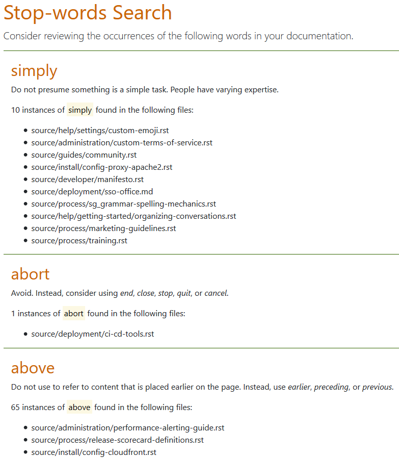

  

# Stop-word search

This app was made as a PoC to participate in the Mattermost 2019 hackathon :slightly_smiling_face: The aim was to look at the Mattermost documentation and find (and review and, if needed, remove or rephrase) words and phrases that might not promote accessibility, diversity, or inclusiveness.

The code in the `stopWords.py` file uses the GitHub `search API` to look for words specified in the `.static\wordList.txt` file and reports the findings through the `.\templates\stopWordsSearch.html` file.

You can use this app for any GitHub repo, though (and not just the Mattermost `docs` repo). You can also use it as a consistency checker for spellings (for example, `plug-in` vs. `plugin` or `color` vs. `colour`) and phrasing (for example, `we recommend` vs. `it is recommended`).

### [Click for a demo](https://mattermost-hackathon-stopwords.herokuapp.com/)

> 

## How to use the app

The code is written in Python but you don't need to know Python to use the app. Follow these steps:

1. Clone this repo, and customise the files to your requirements:

   - `.static\wordList.txt`: Supply your own list of words and phrases by editing this file. Specify each word or phrase on a new line, and add an explanation about why the word or phrase is undesirable and what can be used in its stead. The format is: `<word or phrase>: <explanation or suggestion> new_line`
   - `stopWords.py`: Specify which GitHub repo to search by replacing `mattermost/docs` with the repo name of your choice in `line 10`, for example, `jekyll/jekyll/docs/_docs`.

2. If you have Python, and want to run the app locally, in the `stopWords.py` file, comment out `line 82` and remove the `#` from `line 83`. 
3. If you don't have Python,  or don't want to run the app locally, create an app on Heroku (create a Heroku account and follow the onscreen instructions to create an app). Link your cloned repo to that app, and run a deploy.

## Gotchas

The GitHub API rate limit for un-authenticated requests apply to this app, which means you can make only 60 requests in an hour. If the repo that you're checking has more than a handful of violations, the following things happen:

   - You're timed out, which means the HTML report file is not generated
   - The violations detected until the timeout are printed on your Python console

## Contributing

Raise an issue, and we'll talk there? :relaxed:

Some ideas for enhancements:

- Enable user input to get and use a custom wordlist
- Enable user input to get the name of the GitHub repo to examine
- Enable user input for authenticated API calls to GitHub
- Get the app to work for documentation on ReadTheDocs as well
- Include a file-extensions-to-ignore feature

Pull requests for these, and any other enhancements, welcome :green_heart:
